Welcome to my second Code Institute diploma project.

# Introduction and Overview
For my second project I decided to create a short multiple choice quiz based on the popular TV series The Big Bang Theory.

### **Live Project can be viewed:**  [HERE](https://garycooper-pm.github.io/PP2-JavaScript-Quiz/)

### **The repository can be found here:**  [HERE](https://github.com/GaryCooper-pm/PP2-JavaScript-Quiz)

---

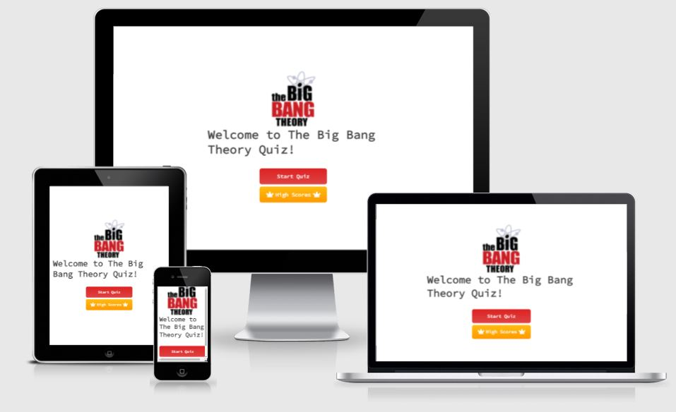

---

# TABLE OF CONTENT
1. [USER STORY](#user-story)
2. [STRUCTURE](#structure)
3. [DESIGN](#design)
4. [TECHNOLOGIES USED](#technologies-used)
5. [TESTING](#testing)
6. [BUGS AND PROBLEMS](#bugs-and-problems)
7. [DEPLOYMENT](#deployment)
8. [CREDITS AND ACKNOWLEDGEMENT](#credits-and-acknowledgement)

# USER STORY
### Visitor to the website
* As a user, I want to easily understand the main purpose of the game
* As a user, I want the game to be fun
* As a user, I want to be able to try something new
* As a user, I want to see obvious and clear buttons to play the game

# STRUCTURE

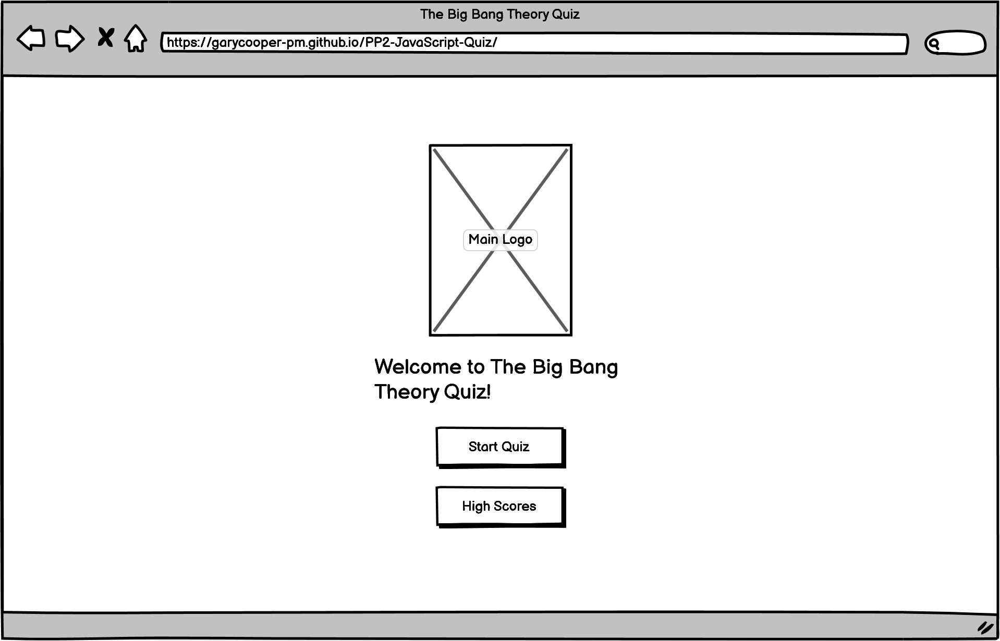

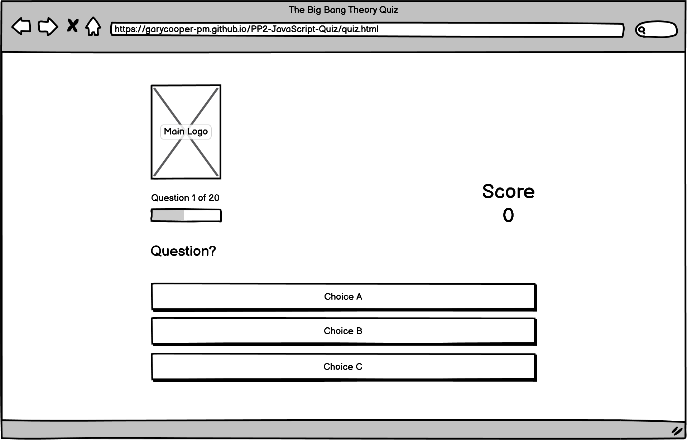

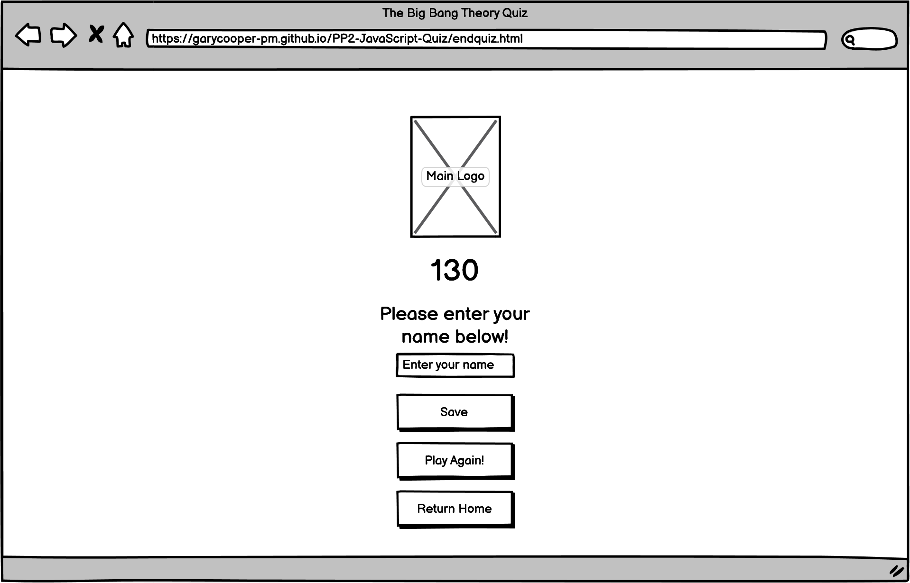

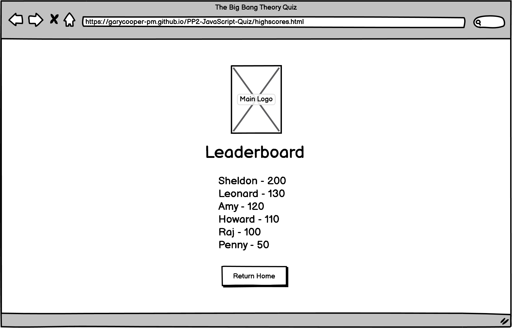

# DESIGN
### Typography
I chose Source Code Pro from [Google Fonts](https://fonts.google.com/) as I felt it went well with the theme of the quiz and the coding challenge.

### Color Palette
I wanted to keep the color pallette simple, utilising the colors within the main logo.

### Text Color

### Button Styling
The buttons throughout the project have a mouseover zoom effect to help the user identify what they are about to click.  The question choices buttons also have a subtle linear gardient

 

### Button Colors
### Highscore Button Gradient
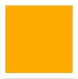 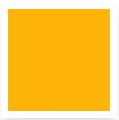
### Answer Choices Button Gradient
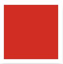 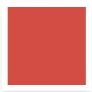
### Correct Choice Button Gradient
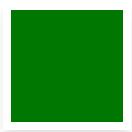 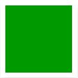
### Incorrect Choice Button Gradient
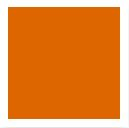 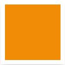

### Icons
The only icons I used in the project were the Crown icon for the High Scores button and the House icon for the Return Home button which were from [FontAwesome](https://fontawesome.com/).

# TECHNOLOGIES USED
* HTML
    * Each page was built using HTML5.
* CSS
    * The styling, layout and media queries were done using CSS3.
* JavaScript
    * The bulk of the quiz code was built using JavaScript ES6.
* Adobe Photoshop
    * The logo was edited to remove the white background to create the png file used.
* Balsamiq
    * The page wireframes were created using Balsamiq.
* GITPOD
  * The IDE used to code this website.
* GIT
  * For version control, commiting and pushing to github.
* GITHUB
  * Used to store repositories, files and images pushed from gitpod.
* CHROME Developer tools
  * For checking compatibilty, troubleshooting and editing code.
* Am I Responsive
  * Used to test responsiveness of the website at different screen sizes.
* FONTAWESOME
  * Used for the style elements on the High Scores button and the Return Home button.

## Development Environment
* [Gitpod](https://gitpod.io): The online IDE I used to write my code in.
* [Github](https://github.com): My repository is housed here.
* I used Google Chrome on a Windows PC for all my work.

# TESTING

Throughout this project I was testing each step of the way when writing my JavaScript to ensure any bugs or problems were identified and resolved early on so as to avoid extensive debugging.
By creating separate game stage pages and JavaScript files for the different elements I was able to easily test and debug smaller sections of code. 

### Passed my html code through [W3C Markup Validator](https://validator.w3.org/)

* Index/Home page _index.html_

[Index html code pass](https://validator.w3.org/nu/?doc=https%3A%2F%2Fgarycooper-pm.github.io%2FPP2-JavaScript-Quiz%2Findex.html)

* Quiz page _quiz.html_

[Quiz html code pass](https://validator.w3.org/nu/?doc=https%3A%2F%2Fgarycooper-pm.github.io%2FPP2-JavaScript-Quiz%2Fquiz.html)

* End of Quiz page _endquiz.html_

[End of Quiz html code pass](https://validator.w3.org/nu/?doc=https%3A%2F%2Fgarycooper-pm.github.io%2FPP2-JavaScript-Quiz%2Fendquiz.html)

* High Scores / Leaderboard page _highscores.html_

[High Scores / Leaderboard html code pass](https://validator.w3.org/nu/?doc=https%3A%2F%2Fgarycooper-pm.github.io%2FPP2-JavaScript-Quiz%2Fhighscores.html)

### Passed my CSS code through JIGSAW [W3C CSS Validator](https://validator.w3.org/)

* style.css

[Style css code pass](https://jigsaw.w3.org/css-validator/validator?uri=https%3A%2F%2Fgarycooper-pm.github.io%2FPP2-JavaScript-Quiz%2Fassets%2Fcss%2Fstyle.css&profile=css3svg&usermedium=all&warning=1&vextwarning=&lang=en)

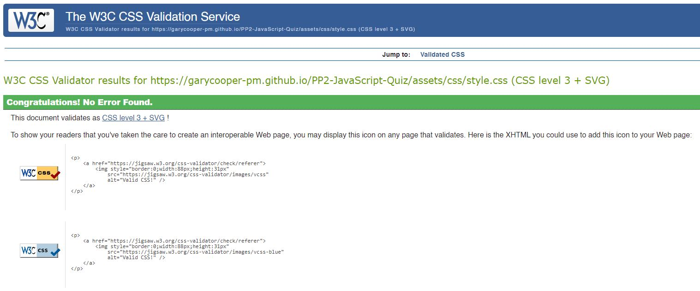

### Passed my JavaScript code through Code Beautify [Code Beautify](https://codebeautify.org/jsvalidate)

### Checked responsiveness through [ami.responsivedesign.is website](http://ami.responsivedesign.is/)

### Checked accessibility through [Lighthouse](https://developers.google.com/web/tools/lighthouse)

Main Page

Quiz Page

Enter Username Page

Leaderboard/High Scores Page

# BUGS AND PROBLEMS

There was an issue with the Save button on the End Quiz page where by it was not activating.  After review of the JavaScript it was due to a const variable being used twice.  To resolve this I created a new JavaScript file (endquiz.js) to write all the End Quiz JavaScript code.

Once I had deployed my project to GitHub Pages and ran through the quiz to test everything, I was met with a 404 page error after answering the final question.  The next screen/page was not being called.  After stepping through my code and chatting with fellow student [Chris Williams](https://github.com/Chr15w1986), I realised I had missed removing two of the absolute file paths in the script.js file and the endquiz.js file.

After these were corrected and everything commited and pushed through I re-ran my tests and everything worked as it should.

# DEPLOYMENT

## Github
### Project Setup:
    * Create new repository in github
    * Select Code Institute Full Template
    * Name and create the repository
    * On the repository page, CLICK the green GITPOD button to launch gitpod
    * Commands used for version control during the project;
        * `git add "example file name"` to add files to stage
        * `git commit -m "commit message"`
        * `git push` to push changes through to main in github

&nbsp;

## Gitpod
### Project Setup:
    * Created basic file structure
        * assets folder
            * css folder (sub-folder of assets)
                * style.css
            * js folder (sub-folder of assets)
                * script.js
                * endquiz.js
                * highscores.js
            * images folder (sub-folder of assets)
        * docs folder
            * images folder (sub-folder of docs for housing the README.md images)
        * index.html
        * quiz.html
        * endquiz.html
        * highscores.html
        * README.md

### This site was deployed using GitHub Pages with the following steps:

1. Click on the `Settings` icon at the top of page in the navigation bar
2. Scroll down until you see `Github Pages`
3. There will be a message box saying "Check it out here" Click on the link to take you to the next page
4. Here you will be greated with a form, Choose the repository `PP2-JavaScript-Quiz`
5. Choose the branch in the drop down box, in this case `MAIN`
6. Choose the directory in the next drop down box, in this case `Root`
7. Then click `Save`
8. It may take a few moments for the site to publish, but once live, the box at the top of the page with the site name will turn green and have a `Green` tick to the left of the link to the live site

# CREDITS AND ACKNOWLEDGEMENT

A huge thank you to my [Code Institue](https://codeinstitute.net/global/) mentor Brian O'Hare for his guidance and support.

My wife Clare and daughters Grace and Emily for their patience and allowing me to work evenings and weekends on my project.

My business partner Damian for his support and belief in me.

My good friend Barry 'Bazzar' Martin for his ears, listening to me constantly wittering on about this module while we were out riding our mountain bikes.

Once again [Chris Williams](https://github.com/Chr15w1986) for being on the other end of the phone when I need to talk through issues.

The [Stack Overflow Community](https://stackoverflow.com/) for providing pointers on storing highscores in local storage.

Code Explained over on [YouTube](https://www.youtube.com/channel/UC8n8ftV94ZU_DJLOLtrpORA) for inspiration for the question progress bar.

FINALLY - I dedicate this project to my father in-law Peter Clifford Lees who sadly passed away peacefully on 09/03/2022 and was unable to see it completed.  R.I.P Peter!

---
