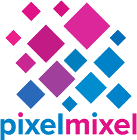

Welcome to my second Code Institute diploma project.

# Introduction and Overview
For my second project I decided to create a short multiple choice quiz based on the popular TV series The Big Bang Theory.

### **Live Project can be viewed:**

### **The repository can be found here:**

---

![Am I Responsive]

---

# TABLE OF CONTENTS
1.[USER STORY](#user-story)
2.[STRUCTURE](#structure)
3.[DESIGN](#design)
4.[TECHNOLOGIES USED](#technologies-used)
5.[TESTING](#testing)
6.[BUGS AND PROBLEMS](#bugs-and-problems)
7.[DEPLOYMENT](#deployment)
8.[CREDITS AND ACKNOWLEDGEMENT](#credits-and-achknowledgement)

# USER STORY
### Visitor to the website

# STRUCTURE

# DESIGN
### Typography
I chose Source Code Pro from [Google Fonts](https://fonts.google.com/) as I felt it went well with the theme of the quiz and the coding challenge.

### Color Palette
I wanted to keep the color pallette simple, utilising the colors within the main logo.

### Icons
The only icon I used in the project was the Crown icon for the High Scores button and was from [FontAwesome](https://fontawesome.com/).